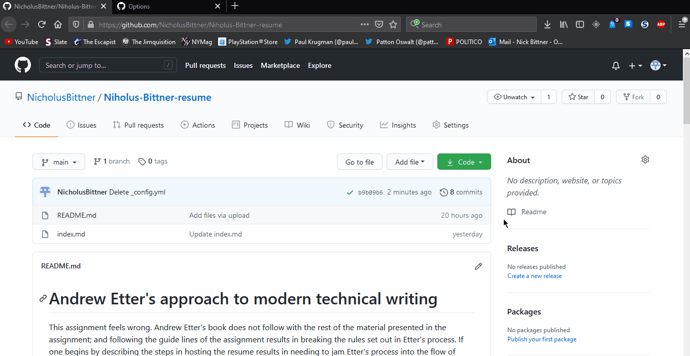

# Hosting a Resume on a Static GitHub Pages Website

1) use static websites; 2) use a lightweight markup language; 3) a distributed file sharing system

## Purpose

This document seeks to explain how to host a simple resume on a GitHub Pages website; and through this explanation convince the reader of the value of modern technical writing. Specifically, demonstrating these principles from Andrew Etter's "Modern Technical Writing: An Introduction to Software Documentation." the ease and flexibility of creating static websites, the speed of lightweight markup, and the versatility and safety of a distributed version control system.

# Prerequisites

Hosting a resume on a GitHub Pages website requires that you have a resume (preferably written in Markdown) and a GitHub account. Before continuing please ensure you have both. If you need help with preparing a resume, a link has been provided under the 'More Resources' section.

If your resume is not in a lightweight markup format, you should make it into one. If The text is not in any markup format, it will not display very well when viewed as a webpage.

## Instructions

This section will cover step-by-step how to set up a GitHub repository with your resume on it and publish it to a GitHub Pages website. To begin, you first need to create a repository an upload your resume to it.

1. login to GitHub.
2. Create a new repository.
3. Name the repository something representative, like [your name] resume.
4. Set the repository to public, GitHub Pages will only host public repositories.
5. Click 'add a file,' there will be a drop down menu.
6. Click 'Upload a file,' this will take you to the file upload screen
7. Drag and drop your resume to the indicated location.
8. Commit the changes, this will upload the file to the repository.

Your resume is now hosted in a GitHub repository, but for it to be hosted properly, you will need to rename it to "index.md." (If you already named your resume this before uploading it, skip these steps) Since index.md is the file GitHub Pages uses to populate its webpages.

1. Select your resume in the repository, this should open a preview of your resume.
2. Open the editor on your resume.
3. Rename your resume as "index.md."
4. Commit the changes.

Now you should be ready to set up a GitHub Pages website.

1. Go to the settings page.
2. Scroll down to the GitHub Pages section.
3. Set the source branch to 'main.'
4. Save the source setting.

From here, you can use the link at the top of the GitHub Pages settings to see your website. Right now it will look very plain; but the Markdown formatting will already be applied. No fiddling with nested tags to get your basic formatting across. You can improve the visual appeal of your website further, by adding a Jekyll theme.
(visual demonstration of the following steps)
 

1. return to the GitHub Pages settings.
2. Select 'Change theme,' this will take you to a catalogue of simple Jekyll themes
3. Look through themes until you find one you like (I personally recommend 'slate,' it is simple and functional)
4. Click 'Select theme,' once you have found a theme you like. This will place a '_config.yml' file into repository. The yml file just points to the theme to be loaded.
5. wait a few minutes for your website to rebuild.

Now when you load your website from the GitHub Pages link it should have the theme you chose applied. (If the style was not applied, you may have chosen a theme that was not 'web ready.' try a different one. Or reload the page; as it may have not finished building)

## More Resources

GitHub flavored Markdown tutorial: [Github.com](https://guides.github.com/features/mastering-markdown/) 

Modern Technical Writing: An Introduction to Software Documentation, by Andrew Etter: [Amazon.ca](https://www.amazon.ca/Modern-Technical-Writing-Introduction-Documentation-ebook/dp/B01A2QL9SS)

Thorough resume writing guide: [umanitoba.ca](https://umanitoba.ca/student/careerservices/media/Resume.pdf) 

## Authors an Acknowledgements

Written by Nicholus Bittner, with editing help from my group members:

- Eriq
- Zijian

Parker moore, for creating the slate theme used for my website

## FAQ

#### What are Markdown and Jekyll? Why should I use them?

Markdown is a simple markup language; it allows you to add simple tags to your text documents for simple web ready formatting. There are many flavors of Markdown; each with their own specific set of supported formatting. For instance GitHub flavored markdown supports tables, but not all flavors support them. The best reason to use Markdown is that it's much easier and faster to use than HTML. On simple documents, Markdown does not require as much text to implement for the same functionality.

Jekyll Is a static website generator; with little effort Jekyll can create a simple website. If you want to host a document on a website with a small amount of formatting, Jekyll can make that in minutes. Jekyll is amazing for producing quick static sites to host most anything you want.

#### I can't find the GitHub Pages settings.

In the settings section, go to the options tab. Then Scroll down to the second last section on the page; that should be it. (No, I don't know why every other guide only tells you to go to the 'GitHub pages section,' and not which tab that section is in)
